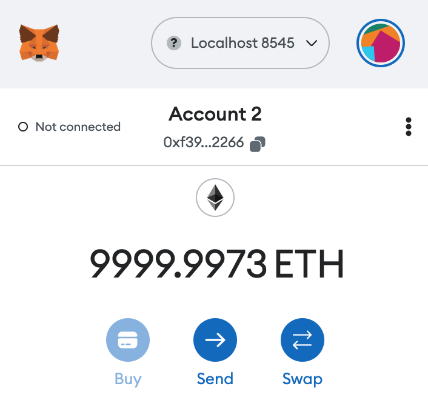

# Web3 CA Blog

This is a decentralised application which uses smart contracts to create, store and edit blogs using the ethereum network.

## Main Technical Stack

- [Next.js](https://nextjs.org/)
- [React](https://reactjs.org/)
- [Hardhat](https://hardhat.org/)
- [Metamask](https://metamask.io/)
- [Infura](https://infura.io/)
- [Polygon](https://polygon.technology/)

This project demonstrates a basic Hardhat use case. It comes with a sample contract, a test for that contract, and a script that deploys that contract.

## Running the App

You can deploy in the localhost network following these steps:

1. Generate testing accounts

```shell
npx hardhat node
```

2. Deploy the contracts to the local network and save the contract info in a config file. In a separate terminal run

```shell
npx hardhat run --network localhost scripts/deploy.js
```

3. Then using [Metamask extension](https://chrome.google.com/webstore/detail/metamask/nkbihfbeogaeaoehlefnkodbefgpgknn) in browser we can check that the local network actually has test ethers to use.



4. Run the development server for Blog UI: (Make sure environment vars are set as "local")

```bash
yarn dev
```

5. Open [http://localhost:3000](http://localhost:3000) with your browser to see the result.

## Using the app

Create posts require a transaccion cost which requires to connect and use the previous test ethers we setup. At the top right of the screen click on the "Connect" button to authenticate with Metamask.
Create your first post!

If you get issues while creating posts, you may have to [reset your metamask account](https://medium.com/@thelasthash/solved-nonce-too-high-error-with-metamask-and-hardhat-adc66f092cd).

Each transaction can take time to process in local mode, but the speed is significantly increased in production mode.

## Testing contracts

We use Hardhat Network to test our contract, a local Ethereum network designed for development.

```shell
npx hardhat test
```

## Deploy

The easiest way to deploy your Next.js app is to use the [Vercel Platform](https://vercel.com/new?utm_medium=default-template&filter=next.js&utm_source=create-next-app&utm_campaign=create-next-app-readme) from the creators of Next.js.

Check out our [Next.js deployment documentation](https://nextjs.org/docs/deployment) for more details.

In order to deploy production contracts you need to switch from the local test network to the [Mumbai Testnet](https://medium.com/stakingbits/how-to-connect-polygon-mumbai-testnet-to-metamask-fc3487a3871f) or Polygon. Use environment variables to setup your custom credentials to Infura as well.

# Architecture v1.0.0


## Flows

Create new post:

1. post request (requires ethers)
2. return hash
3. anchor to smart contract
4. IPFS store

View all post:

1. pre-render route dynamically (SSR)
2. fetch hash for posts from network (requires ethers)
3. retrieve metadata from IPFS

Edit post:

1. fetch hash for posts from network based on post id (requires ethers)
2. retrieve metadata from IPFS + file content (cover image)
3. append post id in post data
4. push to IPFS
5. update anchor to smart contract
